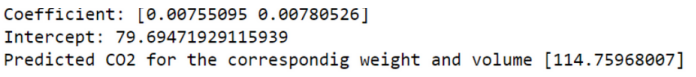

# Implementation of Multivariate Linear Regression
Name:Sriram 
Ref No:22008452
## Aim
To write a python program to implement multivariate linear regression and predict the output.
## Equipment’s required:
1.Hardware – PCs
2.Anaconda – Python 3.7 Installation / Moodle-Code Runner
## Algorithm:
## Step1
Import pandas module as pd
## Step2
From sklearn module import linear_model.
## Step3
Using pd.read_csv function read the cars.csv file
## Step4
Make a list of the independent values(Weight&Volume) and call this variable x and put the dependent values(CO2) in a variable called y
## Step5
From the sklearn module use the LinearRegression() method to create a linear
regression object.This object has a method called fit() that takes the independent and
dependent values as parameters and fills the regression object with data that describes
the relationship
## Step6
Use .coef_ and .intercept_ function to find the coefficient and intercept
## Step7
Predict the Linear Regression using regr.predict() method and print it.
## Step8
End of program.
## Program:
```
import pandas as pd
from sklearn import linear_model
df = pd.read_csv("cars.csv")
x = df[["Weight","Volume"]]
y = df["CO2"]
regr = linear_model.LinearRegression()
regr.fit(x,y)
print("Coefficient:",regr.coef_)
print("Intercept:",regr.intercept_)
predictedCO2 = regr.predict([[3300,1300]])
print("Predicted CO2 for the correspondig weight and volume",predictedCO2)
```
## Output:


## Result
Thus the multivariate linear regression is implemented and predicted the output using python program.